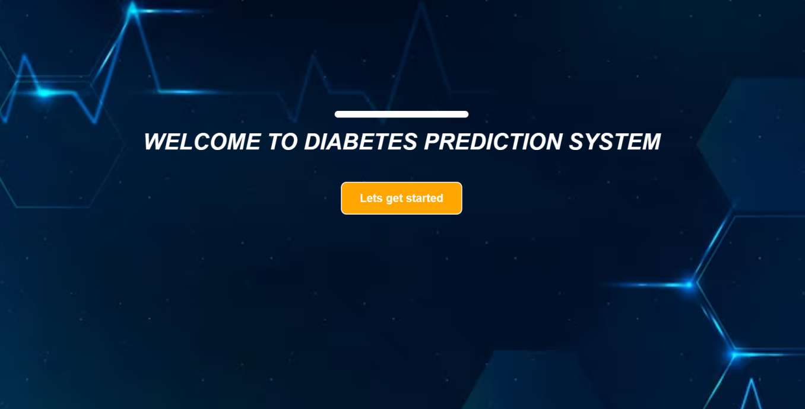
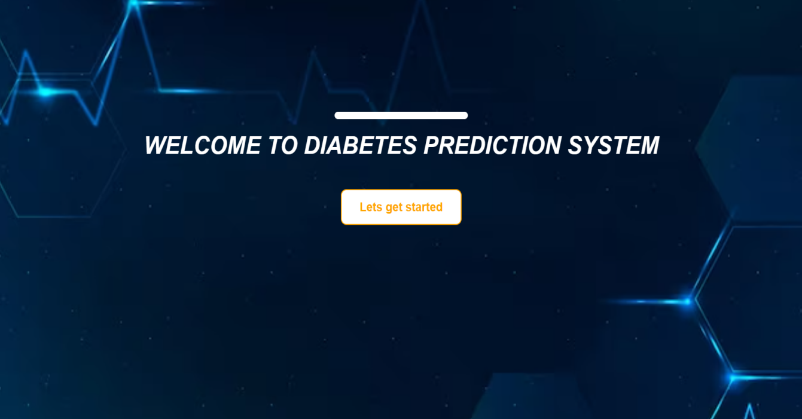
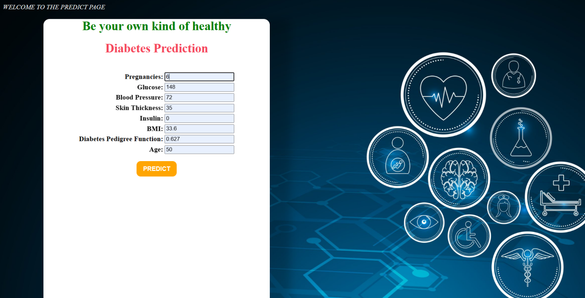
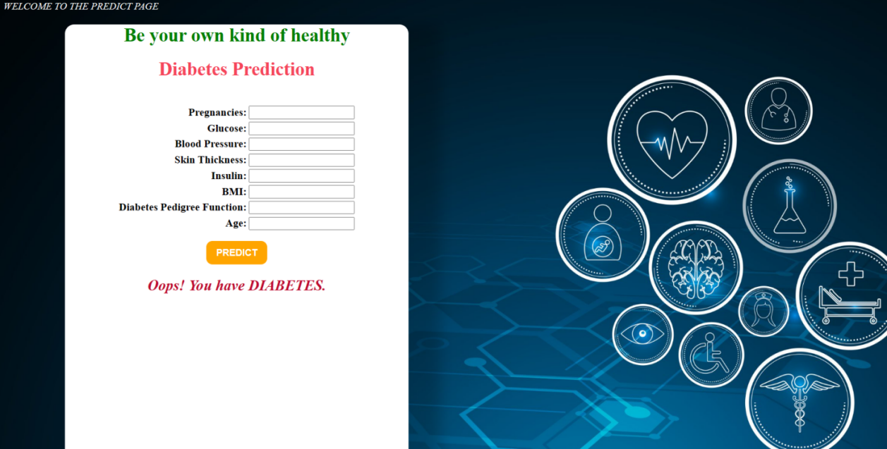

# 🩺 Diabetes Prediction Web Application using Django & Machine Learning

This project is a web-based Diabetes Prediction System developed using Django. It leverages Machine Learning (Logistic Regression) to predict whether a person is diabetic based on input medical attributes. The application features a user-friendly web interface and provides real-time predictions using a trained model.

---

## 🧪 Abstract

Diabetes has emerged as a major global health concern, affecting individuals across all age groups. With rising cases due to lifestyle, diet, and environmental factors, early diagnosis is vital. This project aims to assist in early diabetes prediction by using data analytics and machine learning within a Django-powered web application. Users can enter their health parameters and receive a quick prediction about their diabetic status.

---

## 📝 Problem Statement

There is a pressing need for a digital tool that helps in the early identification of diabetes using modern technology. This project addresses the gap by creating a user-friendly web platform that uses a machine learning model to analyze health data and provide predictions.

---

## 📦 Software Requirements

- Python  
- Django  
- Pandas  
- scikit-learn  
- NumPy  
- HTML/CSS  
- SQLite (default database)  
- IDE: PyCharm  
- Any Web Browser  

---

## 📊 Methodology

1. **Requirement Analysis**: Defined goals, user flow, and key features with healthcare relevance.  
2. **Data Collection**: Used a publicly available diabetes dataset with attributes like glucose, insulin, BMI, etc.  
3. **Data Preprocessing**: Handled missing values, cleaned data, visualized feature correlations using heatmaps.  
4. **Model Training**: Built a logistic regression model using `scikit-learn`.  
5. **Web Integration**: Connected the ML model to a Django backend and built frontend pages using HTML and CSS.  
6. **Testing**: Verified prediction accuracy and validated outputs.  
7. **Deployment Ready**: Can be hosted on platforms like Heroku or Render.  

---

## 💻 User Interface Overview

- **Home Page**: Introductory screen welcoming users to the prediction system with a start button.  
- **Prediction Page**: A form-based page where users input health parameters:
  - Pregnancies
  - Glucose
  - Blood Pressure
  - Skin Thickness
  - Insulin
  - BMI
  - Diabetes Pedigree Function
  - Age
- **Result Display**: After submission, the page displays one of the two messages:
  - “Great! You DON'T have diabetes.”
  - “Oops! You have DIABETES.”

---

## 🌐 Application Flow

- User visits the home page and clicks “Let’s Get Started”.  
- Redirected to the prediction form.  
- Inputs are submitted and processed by the backend.  
- Prediction result is displayed on the same page.  

---

## 📷 Output Screenshots

- **Home Page**: Clean layout with title and start button.  
- **Prediction Page**: Form to input medical details.  
- **Result Display**: A message indicating diabetic status based on model output.  

## Output 

---

## 📁 Project Structure

- `diabetics/`: Main Django project folder (settings, URLs).  
- `diabeticprediction/`: Django app folder with logic and views.  
- `templates/`: Contains `home.html` and `predict.html`.  
- `db.sqlite3`: Default database (optional).  
- `report.docx`: Full project report.  
- `README.md`: This file.

---

## 🛠 How to Run This Project

1. Clone the repository from GitHub.  
2. Create a virtual environment and activate it.  
3. Install the required dependencies using `pip install -r requirements.txt`.  
4. Run migrations to set up the database.  
5. Start the development server.  
6. Open the application in a browser at `http://127.0.0.1:8000/`.  

---

## 📄 Documentation

Refer to `report.docx` included in the repository for:
- Abstract and objectives  
- Diagrams and screenshots  
- Dataset details and attributes  
- Implementation steps  
- Code overview and explanations

---

## 🔮 Future Improvements

- Use advanced machine learning models (e.g., Random Forest, SVM).  
- Add user login and authentication.  
- Save user predictions to a database.  
- Add charts or visual risk indicators.  
- Deploy on cloud services like Heroku or Render.  

---

## 👨‍💻 Developed Using

- Django for backend logic  
- HTML & CSS for frontend UI  
- scikit-learn for machine learning  
- pandas & NumPy for data handling  
- SQLite for database  
- PyCharm as IDE  

---

## 📬 Contact

For feedback or queries:  
📧 vishaditi2003@gmail.com  
🔗 www.linkedin.com/in/aditi-vishwakarma-722610253

---

✅ This project was developed as part of a Machine Learning & Web Technologies Lab assignment. All processing is local; no personal data is stored.
